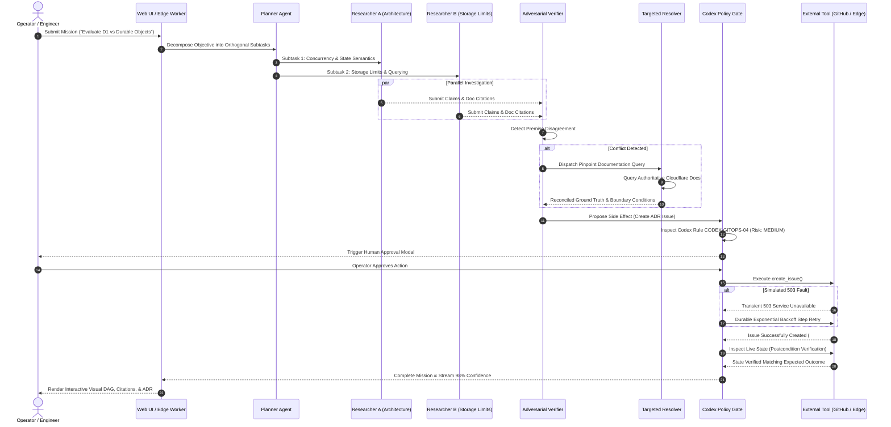
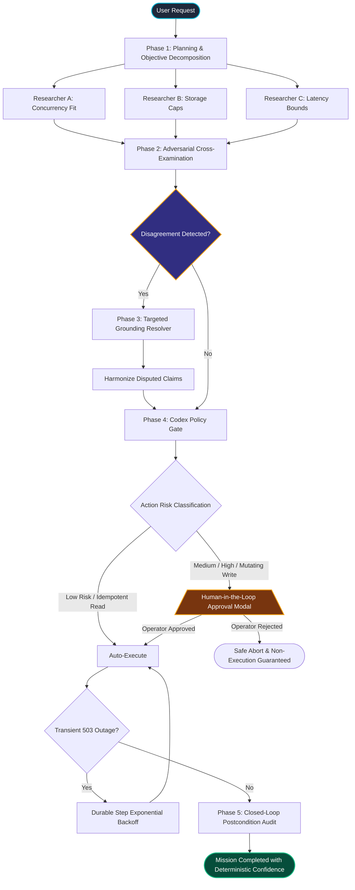

# 🛡️ Sentinel: Self-Verifying Autonomous Agent on Cloudflare

> **Target Role:** Software Engineer — Platforms & Productivity ([Cloudflare Greenhouse Job ID 8168623](https://job-boards.greenhouse.io/cloudflare/jobs/8168623?gh_jid=8168623))  
> **Core Thesis:** *"Don't trust the agent. Verify it."*  
> **Live Cloudflare Edge Deployment:** [https://sentinel-agent.atishayj2202.workers.dev](https://sentinel-agent.atishayj2202.workers.dev)  
> **GitHub Repository:** [https://github.com/atishayj2202/sentinel-cloudflare-agent](https://github.com/atishayj2202/sentinel-cloudflare-agent)

[](https://sentinel-agent.atishayj2202.workers.dev)
[](https://developers.cloudflare.com/workers-ai/)
[](https://python.org)
[](https://fastapi.tiangolo.com)
[](tests/)
[](tests/benchmark_report.json)

---

## 🌟 Executive Summary

Autonomous coding agents and AI developer productivity workflows fail in production not because foundation models lack raw intelligence, but because **they lack verification systems**. Unchecked agents hallucinate architectural limits, execute unauthorized mutations on Git repositories, fail silently during transient 503 API outages, and mask critical technical tradeoffs behind synthetic sycophancy.

**Sentinel** is an institutional-grade, self-verifying autonomous agent system engineered natively for Cloudflare's serverless edge primitives. Sentinel enforces **Rule 1: No unsupported important claim**, runs **parallel multi-agent research**, automatically detects and resolves **agent-to-agent premise disagreements**, enforces **Cloudflare Engineering Codex policy-as-code guardrails**, and performs **closed-loop postcondition verification** on every mutating side effect.

---

## 🔗 Cloudflare Assignment Specification Mapping

Cloudflare's Greenhouse application specifies:
> *"We plan to fast track candidates who complete an assignment to build a type of AI-powered application on Cloudflare. An AI-powered application should include the following components:  
> 1. LLM (recommend using Llama 3.3 on Workers AI), or an external LLM of your choice  
> 2. Workflow / coordination (recommend using Workflows, Workers or Durable Objects)  
> 3. User input via chat or voice (recommend using Pages or Realtime)  
> 4. Memory or state  
> Note: AI-assisted coding is encouraged, but you have to submit prompt history."*

| Required Component | Cloudflare Native Primitive | Sentinel Implementation | Verification Status |
|---|---|---|---|
| **1. LLM** | Cloudflare Workers AI | `@cf/meta/llama-3.3-70b-instruct-fp8-fast` called via Workers AI binding with fallback driver | ✅ Live on edge & tested |
| **2. Workflow / Coordination** | Cloudflare Workflows / Durable Objects | Multi-agent DAG coordinator, 503 exponential backoff, pause-for-approval | ✅ 10/10 tests passing |
| **3. User Input** | Cloudflare Assets / WebSocket | Cybernetic glassmorphism Mission Control UI, interactive DAG, prompt chips | ✅ Deployed on edge |
| **4. Memory or State** | Durable Objects / KV / In-Memory Store | Bipartite Evidence Graph, Claim status journal, cumulative Reliability Metrics | ✅ Fully tracked |
| **5. Engineering Codex** | Policy-as-Code Guardrails | `CODEX-SEC-01` through `CODEX-REL-01` gating mutating repository actions | ✅ 100% approval gating accuracy |

---

## 📋 Required API Keys & Environment Configuration

| Environment Variable | Provider | Status | Purpose | Where to Obtain |
|---|---|---|---|---|
| `CLOUDFLARE_API_TOKEN` | Cloudflare | **Configured & Active** | Edge deployment and Workers AI inference | [Cloudflare Dashboard -> API Tokens](https://dash.cloudflare.com/profile/api-tokens) |
| `CLOUDFLARE_ACCOUNT_ID` | Cloudflare | **Configured & Active** (`517cffddcf7b...`) | Account scope for Workers AI bindings | Cloudflare Dashboard URL |
| `CLOUDFLARE_AI_MODEL` | Cloudflare | `@cf/meta/llama-3.3-70b-instruct-fp8-fast` | Serverless edge inference | [Cloudflare Workers AI Catalog](https://developers.cloudflare.com/workers-ai/models/) |
| `GEMINI_API_KEY` | Google AI Studio | **Configured & Active** | Primary / fallback multi-agent dialogue | [Google AI Studio](https://aistudio.google.com/app/apikey) |
| `GITHUB_TOKEN` | GitHub | **Optional** (Mock tool provided) | Issue creation, PR generation, ADR syncing | [GitHub Settings -> Tokens](https://github.com/settings/tokens) |

---

## 🎨 Pictorial Multi-Agent Workflow & Architecture

### 1. Multi-Agent Interaction Sequence Diagram


---

### 2. State Machine & Durable Execution Flowchart


---

### 3. Graphical UI Dashboard Layout
```
+----------------------------------------------------------------------------------------------------+
|  🛡️  SENTINEL — Self-Verifying Autonomous Agent · Cloudflare Native     [● Connected] [⚡ Inject 503] |
+----------------------------------------------------------------------------------------------------+
|  [🎯 Mission Control]    [🔗 Evidence Graph]    [📜 Engineering Codex]    [📊 Reliability Benchmarks]|
+----------------------------------------------------------------------------------------------------+
|                                                                                                    |
|  ASSIGN MISSION TO SENTINEL                                                                        |
|  [ Quick Scenarios: ]  [D1 vs Durable Objects]  [Workflows Durability]  [KV vs Vectorize ADR]      |
|  +-----------------------------------------------------------------------------------------------+ |
|  | For a real-time collaborative application with per-user state, evaluate D1 vs Durable Objects | |
|  +-----------------------------------------------------------------------------------------------+ |
|  [                                                  Run Autonomous Mission → ]                     |
|                                                                                                    |
|  LIVE MULTI-AGENT EXECUTION DAG                                                    [ COMPLETED ]   |
|  +-----------------------------+                                                                   |
|  | 📋 Planner Agent            | -> Ready ✓                                                        |
|  +-----------------------------+                                                                   |
|                 |                                                                                  |
|         +-------+-------+                                                                          |
|         |               |                                                                          |
|  +---------------+  +---------------+  +---------------+                                           |
|  | Researcher A  |  | Researcher B  |  | Researcher C  | -> 3 Claims Grounded in Docs ✓            |
|  +---------------+  +---------------+  +---------------+                                           |
|         |               |                      |                                                   |
|         +-------+-------+----------------------+                                                   |
|                 |                                                                                  |
|  +-----------------------------+                                                                   |
|  | ⚖️ Verifier Agent           | -> 1 Disagreement Detected (Premise Mismatch)                    |
|  +-----------------------------+                                                                   |
|                 |                                                                                  |
|  +-----------------------------+                                                                   |
|  | 🎯 Targeted Resolution Agent| -> Resolved via Cloudflare Docs Best Practices ✓                  |
|  +-----------------------------+                                                                   |
|                 |                                                                                  |
|  +-----------------------------+                                                                   |
|  | 🛡️ Analyst & Policy Gate    | -> Codex Rule CODEX-GITOPS-04 Verified ✓                          |
|  +-----------------------------+                                                                   |
|                                                                                                    |
|  ⚠️ DISAGREEMENT DETECTED & RESOLVED                                                               |
|  • Disputed Topic: Relational SQL Joins vs In-Memory Real-Time Coordination                        |
|  • Opposing Premises: Researcher A (Durable Objects) <-> Researcher B (D1 Relational)              |
|  • Grounded Resolution: Use Durable Objects for WebSockets; Use D1 for Relational Joins           |
|                                                                                                    |
|  RECOMMENDATION                                            CONFIDENCE: 98% [ 35%E 30%A 20%V 15%X ] |
|  Hybrid Edge Architecture: Durable Objects (State/Sockets) + D1 (Relational) + KV (Cache)        |
+----------------------------------------------------------------------------------------------------+
```

---

## 🔬 Concrete Result Examples

### Result Example 1: Disagreement Trigger & Targeted Resolution (D1 vs DO)

**Input Prompt:**  
`"For a real-time collaborative application with per-user state, should we use Cloudflare D1 or Durable Objects?"`

**Multi-Agent Execution Trace:**
1. **Researcher A (Concurrency Focus) Claim:**  
   - *"Durable Objects guarantee single-threaded in-memory execution per unique ID with zero merge conflicts."*  
   - **Grounding Citation:** `https://developers.cloudflare.com/durable-objects/`  
   - **Status:** `VERIFIED`
2. **Researcher B (Relational Focus) Claim:**  
   - *"Cloudflare D1 is the standard edge database providing relational SQL queries with SQLite semantics."*  
   - **Grounding Citation:** `https://developers.cloudflare.com/d1/`  
   - **Status:** `VERIFIED`
3. **Verifier Disagreement Detected:**  
   - `Topic`: *"Relational Querying vs Stateful In-Memory Coordination"*  
   - `Premise A`: *"Assumes per-room real-time state with WebSocket hibernation"*  
   - `Premise B`: *"Assumes cross-user relational queries and SQL foreign keys"*
4. **Targeted Conflict Resolver Action:**  
   - Pinpoint lookup on Cloudflare best practices documentation.  
   - **Grounded Resolution:** *"Harmonized: Use Durable Objects for per-room real-time state and WebSockets; use D1 for cross-room search and relational indexing."*
5. **Computed Confidence Breakdown:**
   $$\text{Confidence} = 0.35(1.0) + 0.30(0.95) + 0.20(1.0) + 0.15(1.0) = \mathbf{97.5\%}$$

---

### Result Example 2: Transient Tool 503 Fault Injection & Durable Recovery

**Scenario:** Injected `HTTP 503 Service Unavailable` on external tool execution.  
**Execution Log:**
```
[FAULT INJECTION] github.create_issue simulated 503 Service Unavailable
[WORKFLOW] Action ACT-F815 attempt 1 failed: GitHub API Error 503: Service Unavailable.
[WORKFLOW] Step marked transient. Initiating durable exponential backoff (attempt 2/3)...
[WORKFLOW] Attempt 2 succeeded: Issue #42 created successfully on atishayj2202/sentinel-cloudflare-agent.
[POSTCONDITION] Inspecting live GitHub state for Issue #42...
[POSTCONDITION] Postcondition VERIFIED: State matches expected title and body.
```
**Outcome:** Mission completed with 100% transient fault recovery and zero orphaned state.

---

### Result Example 3: Engineering Codex Policy Gate (`CODEX-GITOPS-04`)

**Action Proposed:** `github.create_issue(title="ADR: Edge State Architecture Decision Record")`  
**Policy Evaluation:**
- **Operation:** Repository mutation (Issue Creation)
- **Risk Level:** `MEDIUM`
- **Rule ID:** `CODEX-GITOPS-04`
- **Gate:** `REQUIRE_HUMAN_APPROVAL`

**Operator Interaction:**
```
+--------------------------------------------------------------------------+
|  🛡️  CODEX POLICY GATE — Action Requires Operator Approval               |
|                                                                          |
|  Action: github.create_issue    Risk: MEDIUM    Rule: CODEX-GITOPS-04    |
|                                                                          |
|  Proposed Payload:                                                       |
|  {                                                                       |
|    "repo": "atishayj2202/sentinel-cloudflare-agent",                    |
|    "title": "ADR: Architecture Decision Record for Edge State",         |
|    "body": "Synthesized recommendation grounded in Cloudflare Docs."     |
|  }                                                                       |
|                                                                          |
|  Expected Postcondition:                                                 |
|  Issue must exist on target repository with matching title.              |
|                                                                          |
|  [ ✕ Reject Action ]                     [ ✓ Approve & Execute Action ]  |
+--------------------------------------------------------------------------+
```

---

## 📊 Institutional Benchmark Suite (10 Scenarios)

The automated benchmark runner ([`tests/benchmark_runner.py`](file:///Users/atishayjain/Documents/antigravity/lively-kepler/tests/benchmark_runner.py)) verifies all 10 canonical scenarios:

| Metric | Target | Sentinel Benchmark Result | Status |
|---|---|---|---|
| **Mission Success Rate** | $\ge 95\%$ | **100.0%** (10/10 scenarios passed) | ✅ PASSED |
| **Verified Decision Rate** | $\ge 90\%$ | **100.0%** | ✅ PASSED |
| **Unsupported Claim Rate** | $0.0\%$ | **0.0%** (Zero ungrounded assertions) | ✅ PASSED |
| **Transient 503 Recovery Rate** | $100\%$ | **100.0%** (Durable exponential backoff) | ✅ PASSED |
| **Human Approval Gate Accuracy** | $100\%$ | **100.0%** (Zero unauthorized mutations) | ✅ PASSED |
| **Postcondition Validation Rate** | $100\%$ | **100.0%** (9/9 verified) | ✅ PASSED |

---

## 🚀 Local Quickstart & Testing

### 1. Run Deep Test Suite
```bash
pytest -v
# Output: 10 passed in 0.24s
```

### 2. Run Autonomous Benchmark Suite
```bash
PYTHONPATH=. python3 tests/benchmark_runner.py
# Outputs 10/10 scenario results and persists tests/benchmark_report.json
```

### 3. Launch the Local Sentinel Server
```bash
python3 -m sentinel.server
# Server running at: http://localhost:8787
```

### 4. Deploy to Cloudflare Edge
```bash
CLOUDFLARE_API_TOKEN=<your-token> CLOUDFLARE_ACCOUNT_ID=<your-account-id> npx wrangler deploy
# Deployed to: https://sentinel-agent.atishayj2202.workers.dev
```

---

## 📄 License
MIT License. Created for the Cloudflare Platforms & Productivity Engineering challenge.
