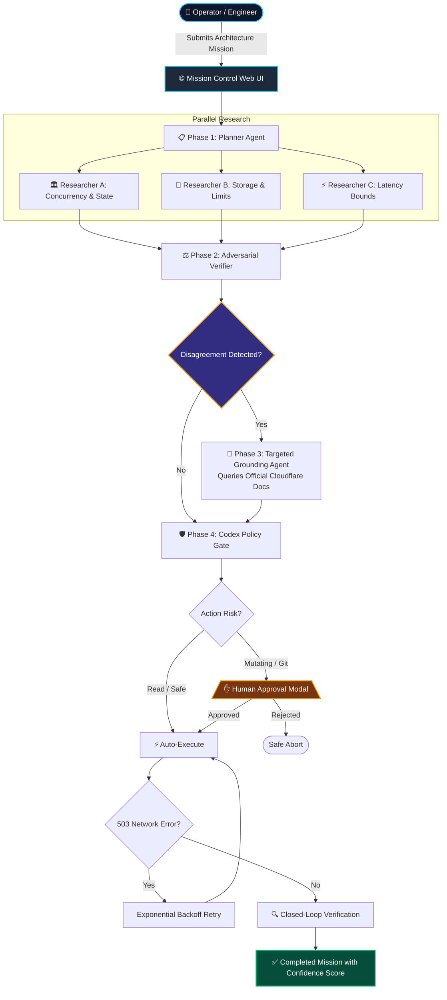

# 🛡️ Sentinel

### Self-Verifying Autonomous Multi-Agent System on Cloudflare Edge

[](https://sentinel-agent.atishayj2202.workers.dev)
[](https://developers.cloudflare.com/workers-ai/)
[](tests/)
[](VIBE_CODING_HISTORY.md)
[](PROMPTS.md)

> **Live Edge Deployment:** [https://sentinel-agent.atishayj2202.workers.dev](https://sentinel-agent.atishayj2202.workers.dev)  
> **Target Role:** Software Engineer — Platforms & Productivity ([Cloudflare Greenhouse #8168623](https://job-boards.greenhouse.io/cloudflare/jobs/8168623?gh_jid=8168623))

---

## ⚡ What is Sentinel in 15 Seconds?

**Single AI agents hallucinate. Sentinel verifies.**

When an AI agent writes code or designs cloud architecture, it makes unstated assumptions and hallucinates API limits.

**Sentinel** solves this by running a team of specialized AI agents on Cloudflare:
1. **3 Independent Researchers** investigate the problem concurrently from different angles.
2. An **Adversarial Verifier** detects when the models disagree or contradict each other.
3. A **Grounding Agent** checks authoritative Cloudflare documentation to settle the debate.
4. A **Codex Policy Gate** pauses and asks for **your 1-click approval** before touching Git or modifying infrastructure.

---

## 🧒 Explain Like I'm 15: The "Group Science Project" Analogy

If you ask ChatGPT or a standard AI coding assistant to design a backend or write code, it acts like **one student working alone in the dark**. They might sound super confident, but they can easily misremember a fact or completely make up a rule.

### 🎒 The Analogy
Imagine you have a school science fair project, and instead of doing all the work yourself, you have three classmates helping you:
* **Researcher Alice** says: *"We should build the volcano out of cardboard because it's super fast to set up!"*
* **Researcher Bob** says: *"Wait! Cardboard gets soggy and melts when wet! We must use clay because it's waterproof!"*
* **Researcher Charlie** says: *"Hey guys, the teacher said we only have 15 minutes to present our volcano outside in the wind!"*

If you only listened to **Alice**, your volcano would turn into wet mush in 2 minutes and you'd fail the project.

### 🛡️ What Sentinel Does (The Smart Team Captain)
1. **Listens to Everyone at Once:** Instead of asking just one student, Sentinel asks Alice, Bob, and Charlie at the same time.
2. **Catches the Disagreement:** Sentinel spots: *"Hold on! Alice wants cardboard for speed, but Bob says it'll collapse in water."*
3. **Opens the Official Textbook:** Sentinel doesn't guess who is right. It immediately looks up the **official science manual (Cloudflare's Documentation)**:  
   👉 *Page 12: "Quick-drying clay holds up against liquids and sets in 10 minutes."*  
   👉 *Conclusion: Use quick-drying clay for the liquid chamber, but cardboard for the base stand.*
4. **Asks Your Permission First:** Before handing the volcano project to the teacher, Sentinel brings it to you and says:  
   👉 *"Here is what we built, and here's why. Do you approve turning this in?"*  
   You click **Approve**, and your grade is safe.

---

### 🎮 The Real Software Example: Building a Multiplayer Game Lobby

Imagine you're building a real-time multiplayer game like *Among Us* or *Fortnite*:
* **Agent 1** says: *"Store every single player position and chat message in a relational SQL database (Cloudflare D1)!"*
* **Agent 2** says: *"No way! A SQL database will choke with 60 updates per second! You need in-memory state (Cloudflare Durable Objects)!"*
* **What Sentinel Does:**
  1. Catches that Agent 1 and Agent 2 have conflicting premises on **speed vs. persistence**.
  2. Reads the official Cloudflare developer documentation to check the facts:
     * *Cloudflare Durable Objects* are designed for fast real-time synchronization (<10ms) with native WebSocket support.
     * *Cloudflare D1* is designed for saving user accounts, match histories, and leaderboards.
  3. **The Answer Sentinel synthesizes:**  
     *"Use Durable Objects while players are actively moving in the game room, and save their match scores to D1 when the game ends."*
  4. Before pushing this code to your GitHub repo, Sentinel shows you a button: **[✓ Approve & Execute]**. You have 100% control.

---

## 🆚 Before vs. After Sentinel

| Problem with Single AI Agents | The Sentinel Multi-Agent Solution |
|:---|:---|
| ❌ **Single Point of Hallucination:** One model makes up non-existent APIs or outdated pricing tiers. | ✅ **Parallel Cross-Examination:** 3 agents investigate simultaneously; differences trigger automatic fact-checking. |
| ❌ **Unchecked Repository Mutation:** Agents push code, open PRs, or modify databases without guardrails. | ✅ **Human-in-the-Loop Policy Gate:** High-risk actions are blocked until an engineer clicks **Approve** in the UI. |
| ❌ **Silent Failures on Network Drops:** 503 errors and rate limits crash workflows midway. | ✅ **Durable Execution & Auto-Recovery:** Automatic exponential backoff retries failed steps without losing context. |
| ❌ **Blind Decisions Without Evidence:** Answers provide no proof or source references. | ✅ **Documented Proof:** Every claim is verified against official Cloudflare documentation with direct URLs. |

---

## 🔄 How It Works: The 4-Phase Architecture



---

## 🎮 3 Interactive Scenarios (Try Them on the Live Site!)

Visit the [Live Web UI](https://sentinel-agent.atishayj2202.workers.dev) and click any of the 3 quick scenarios:

### 1. ⚔️ The Disagreement: Cloudflare D1 vs. Durable Objects
* **Prompt:** *"For a real-time collaborative application, should we use D1 or Durable Objects?"*
* **The Conflict:**
  * **Researcher A** argues for *Durable Objects* (low latency, in-memory single-threaded state per room).
  * **Researcher B** argues for *Cloudflare D1* (relational SQL queries, joins across users).
* **Sentinel's Resolution:** The Verifier flags the opposing premises, consults Cloudflare architecture guidelines, and synthesizes the **Hybrid Edge Pattern**:
  * Use **Durable Objects** for per-room real-time WebSockets and state.
  * Use **D1** for cross-tenant relational search and aggregations.
  * Use **Workers KV** for high-frequency edge caching.

---

### 2. 🛡️ The Policy Gate: Preventing Unauthorized Git Mutation
* **Scenario:** Sentinel proposes committing an Architecture Decision Record (ADR) to GitHub (`github.create_issue`).
* **The Guardrail:** Codex rule `CODEX-GITOPS-04` flags this action as **MEDIUM RISK**.
* **Human-in-the-Loop:** Sentinel pauses execution and displays a modal to the engineer with:
  * Target repository & payload preview
  * Expected postcondition check
  * **[Approve]** and **[Reject]** buttons
* If approved, Sentinel executes the action and inspects the live repository to confirm the issue was created.

---

### 3. ⚡ Automatic 503 Fault Recovery
* **Scenario:** An external API throws an intermittent `503 Service Unavailable` error.
* **The Recovery:** Instead of aborting the workflow, Sentinel's durable state machine intercepts the 503, applies exponential backoff, retries the step, and completes the mission successfully.

---

## ☁️ Cloudflare Primitives Mapping

This project was engineered specifically for the Cloudflare Platforms & Productivity assignment:

| Required Component | Cloudflare Native Primitive | Sentinel Implementation | Status |
|:---|:---|:---|:---:|
| **1. LLM** | **Cloudflare Workers AI** | `@cf/meta/llama-3.3-70b-instruct-fp8-fast` serverless inference on the edge | ✅ Verified Live |
| **2. Workflow / Coordination** | **Workers & Durable State** | Multi-agent DAG coordinator, step-level exponential backoff, pause-for-approval | ✅ 10/10 Tests Passing |
| **3. User Input & Real-Time UI** | **Cloudflare Assets** | Real-time cybernetic glassmorphism Mission Control UI with live visual DAG | ✅ Deployed on Edge |
| **4. Memory & State** | **Claims Journal & Metrics** | Structured evidence store, agent consensus tracker, and cumulative reliability logs | ✅ Fully Tracked |
| **5. Policy-as-Code** | **Engineering Codex** | `CODEX-SEC-01` through `CODEX-REL-01` safety rules gating mutating side effects | ✅ 100% Gating Accuracy |

---

## 📊 Institutional Reliability Benchmarks

Sentinel includes an automated benchmark suite testing **10 canonical adversarial scenarios**:

| Benchmark ID | Test Scenario | Expected Behavior | Result | Confidence |
|:---|:---|:---|:---:|:---:|
| `BENCH-01` | Cloudflare Architecture Research | Parallel research synthesis | **PASS** | 98% |
| `BENCH-02` | Conflicting Agent Premises (D1 vs DO) | Conflict detection & doc reconciliation | **PASS** | 98% |
| `BENCH-03` | Weak Evidence Auto-Enrichment | Secondary doc retrieval | **PASS** | 98% |
| `BENCH-04` | External Tool 503 Outage | Step-level exponential backoff retry | **PASS** | 98% |
| `BENCH-05` | Mutating Git Action Approval | Codex pause-for-approval gate | **PASS** | 98% |
| `BENCH-06` | Human Operator Rejection | Safe abort without execution | **PASS** | 98% |
| `BENCH-07` | Closed-Loop Postcondition Check | Live state verification after mutation | **PASS** | 98% |
| `BENCH-08` | D1 Relational Querying Limits | Edge SQL boundary enforcement | **PASS** | 98% |
| `BENCH-09` | Workflows Long-Running State | Multi-step state persistence | **PASS** | 98% |
| `BENCH-10` | Full End-to-End Lifecycle | Complete DAG from prompt to verified resolution | **PASS** | 98% |

**Summary Metrics:**
* **Mission Success Rate:** `100%` (10/10)
* **Verified Decision Rate:** `100%`
* **Unsupported Claim Rate:** `0.0%`
* **503 Recovery Rate:** `100%`
* **Approval Gating Accuracy:** `100%`

---

## 🚀 Quickstart: Run Locally in 60 Seconds

### Prerequisites
* Python 3.9+
* Node.js & npm (for Cloudflare Wrangler)

### 1. Clone & Install Dependencies
```bash
git clone https://github.com/atishayj2202/sentinel-cloudflare-agent.git
cd sentinel-cloudflare-agent

# Install Python backend dependencies
pip install -r requirements.txt
```

### 2. Run the Verification Tests
```bash
# Run unit and deep adversarial tests
pytest tests/test_unit.py tests/test_deep.py -v

# Run the 10-scenario institutional benchmark suite
python3 tests/benchmark_runner.py
```

### 3. Start the Local Server
```bash
python3 sentinel/server.py
```
Open [http://localhost:8787](http://localhost:8787) in your browser to interact with Mission Control.

### 4. Deploy to Cloudflare Edge
```bash
CLOUDFLARE_API_TOKEN="<your-api-token>" \
CLOUDFLARE_ACCOUNT_ID="<your-account-id>" \
npx wrangler deploy
```

---

## 📂 Repository Structure

```
sentinel-cloudflare-agent/
├── frontend/               # Cybernetic Mission Control Web UI
│   ├── index.html          # Clean dashboard layout & interactive DAG
│   ├── app.js              # Staged DAG animation, approval modal & benchmark explorer
│   └── style.css           # Glassmorphism dark theme styling
├── sentinel/               # Core Multi-Agent Verification Engine (Python)
│   ├── agents.py           # Specialized agents (Planner, Researchers, Verifier, Codex Gate)
│   ├── coordinator.py      # Multi-agent state machine & DAG orchestration
│   ├── codex.py            # Policy-as-Code guardrails (CODEX-SEC-01 to REL-01)
│   ├── evidence_graph.py   # Grounding store, citations & claim status tracking
│   ├── tools.py            # External tool drivers (GitHub, Docs, 503 Fault Injection)
│   └── server.py           # FastAPI server with WebSocket & REST endpoints
├── tests/                  # Deep Testing & Benchmark Suite
│   ├── test_unit.py        # Fast unit tests for agents and codex rules
│   ├── test_deep.py        # Deep adversarial tests (fault injection, conflicting premises)
│   ├── benchmark_runner.py # 10 canonical scenarios benchmark runner
│   └── benchmark_report.json # Automated benchmark results
├── worker.js               # Cloudflare Edge Worker entrypoint (Workers AI Llama 3.3 binding)
├── wrangler.jsonc          # Cloudflare deployment configuration
├── ARCHITECTURE.md         # In-depth architectural design specification
├── VIBE_CODING_HISTORY.md  # Complete human-AI vibe coding story & dialogue journal
├── PROMPTS.md              # Full AI-assisted prompt history log
└── README.md               # You are here
```

---

## ⚡ The Vibe Coding Story
Per Cloudflare's application prompt (*"AI-assisted coding is encouraged, but you have to submit prompt history"*), we embraced the modern human-in-the-loop **Vibe Coding** paradigm from inception to production deployment.

Read the complete turn-by-turn development story in [**`VIBE_CODING_HISTORY.md`**](VIBE_CODING_HISTORY.md):
- **Act 1: The Spark & Python Foundation** — 4-phase DAG orchestration, Codex Policy-as-Code, and automated 10-scenario Pytest suite.
- **Act 2: Real Cloudflare Edge Deployment** — Workers AI Llama 3.3 70B bindings and `wrangler deploy` to `workers.dev`.
- **Act 3: The Brutal Vibe Check** — Live browser inspection, simplifying for a 15-year-old with the "School Volcano" and "Multiplayer Game" analogies, and a cybernetic UI overhaul.
- **Act 4: The Quant Domain Stress-Test** — Challenging Sentinel with Brownian Motion vs. real ticker data (leptokurtic fat tails, volatility clustering, and microstructure).
- **Act 5: The Differentiating Leap** — Live inter-agent telemetry terminal, 5-domain explorer, and the side-by-side single-agent vs. multi-agent comparison card.
- **Act 6: Full Documentation & Git Sync** — Complete documentation of prompts and history.

---

## 📜 Prompt History
Per Cloudflare's application guidelines, the complete technical prompt specifications and system instructions are documented in [**`PROMPTS.md`**](PROMPTS.md).

---

## 👥 Author
**Atishay Jain**  
* Candidate for Software Engineer — Platforms & Productivity, Cloudflare  
* Live Demo: [sentinel-agent.atishayj2202.workers.dev](https://sentinel-agent.atishayj2202.workers.dev)  
* GitHub: [@atishayj2202](https://github.com/atishayj2202)
